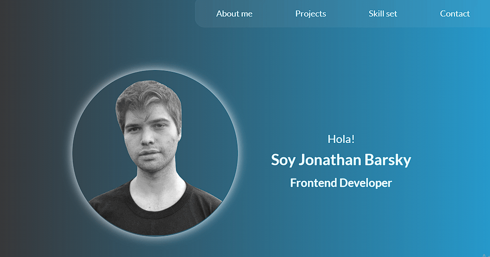

# Portafolio Personal



Este es mi portafolio personal para mostrar mis proyectos y habilidades como Frontend developer


## Construido con 🛠️: 
-  
-  
-  
- 

## Comenzando 🚀

_Estas instrucciones te permitirán obtener una copia del proyecto en funcionamiento en tu máquina local para propósitos de desarrollo y pruebas._

### Instalación 🔧

#### Fork del repositorio

1- Haz un fork de este proyecto a tu repositorio de github clickeando el boton de fork.

2- Puedes cambiar el nombre del proyecto o dejarlo como esta.

3- Haz click donde dice hacer fork.

#### Clonando el proyecto a tu repositorio local

1- En tu repositorio remoto ve al boton que dice <>code.

2- Selecciona el formato del link ya sea con HTTPS o con llaves SSH, si no tienes configuradas las llaves SSH usa HTTPS.

3- Copia el link.

4- Ve a tu terminal de git.

5- Situate en la carpeta donde queres clonar el proyecto.

6- Escribe en la terminal
  ```
  git clone linkQueCopiaste
  ```
  Esto creara una carpeta con el nombre del proyecto y todos sus archivos dentro.
  
7- En mi caso con SSH quedaria asi 
  ```
  git clone git@github.com:jonathanbarsky/portafolio-personal.git
  ```
  y con HTTPS quedaria asi git clone 
  ```
  git clone https://github.com/jonathanbarsky/portafolio-personal.git
  ```
  
8- Espera a que termine de clonar y listo.

9- Si tienes instalado Visual Studio Code puedes posicionarte dentro de la carpeta del proyecto y poner
  ```
  code .
  ```
  Esto va a abrir VSC con el proyecto y vas a poder jugar con el código.
  
10- Happy coding!

## Versionado 📌

Este proyecto esta :construction: en construcción :construction: actualmente, muy pronto voy a implementar el versionado para el mismo.

## Licencia 📄

Este proyecto está bajo la Licencia MIT.


⌨️ con ❤️ por [Jonathan Barsky](https://github.com/jonathanbarsky) 😊
